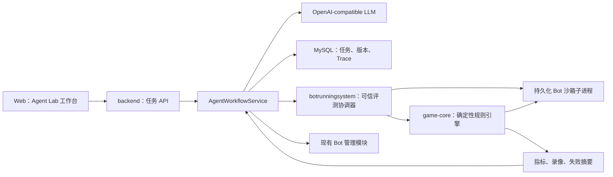

# KOB Agent Lab 设计规格

> 状态：已完成对话评审
> 日期：2026-07-16
> 目标岗位：Java 后端工程师与 AI Agent 工程交叉方向
> 交付周期：1～2 周
> 交付形态：本地一键启动、演示视频、完整 README

## 1. 背景

KOB 当前是一个在线贪吃蛇 Bot 对战平台，已经具备以下基础能力：

- `backend` 负责账户、Bot 管理、实时对战、录像和排行榜。
- `matchingsystem` 负责基于积分与等待时间的玩家匹配。
- `botrunningsystem` 负责动态编译和执行用户提交的 Java Bot。
- WebSocket 承载实时对战协议，MySQL 保存用户、Bot 和对局记录。
- Bot 执行已经具备进程级隔离、执行超时和独立临时目录。
- 对局协议已经包含 `gameId` 与 `roundId`，可以识别迟到、重复和串局回调。
- 项目已经建立后端、前端和 Playwright 测试护栏。

现有项目的主要价值集中在实时系统、代码执行沙箱和游戏规则。Agent 化改造应复用这些能力，形成可验证的任务闭环，而不是增加与业务割裂的聊天功能。

## 2. 产品定位

项目升级后的名称为：

**KOB Agent Lab：基于自动评测反馈的自主进化 Bot 平台**

用户使用自然语言描述策略目标。Agent 在受控工具集合内完成 Java Bot 生成、沙箱编译、批量对战、失败分析和策略改进，最多完成 3 轮可评测版本，最终交付最佳 Bot 与完整演进报告。

系统采用「LLM 负责规划与生成，确定性引擎负责执行与评测」的混合架构。任何胜率、延迟或稳定性结论都必须来自工程侧计算，不能由模型自行判断。

## 3. 目标

### 3.1 功能目标

- 支持通过自然语言创建 Agent 优化任务。
- 支持生成、编译和保存 Java Bot 版本。
- 支持在隔离沙箱中批量运行固定评测集。
- 支持最多 3 轮「生成、评测、分析、改进」。
- 支持公开评测集与隐藏验证集。
- 支持保存 Agent Trace、工具调用、版本差异和评测结果。
- 支持任务取消、失败定位和服务重启后的任务恢复。
- 支持将最佳版本保存为用户的正式 Bot。
- 支持播放代表性成功或失败录像。

### 3.2 工程目标

- 在线对战与离线评测共用同一套确定性规则。
- Agent 生成的代码不得进入 `backend` 主 JVM。
- Agent 工具调用必须有状态约束、幂等保护和资源上限。
- 自动化测试不依赖真实 LLM，也不消耗线上 Token。
- 现有真人对战、Bot 对战、录像和排行榜行为保持不变。

### 3.3 面试目标

项目应能证明以下能力：

- Java 多模块系统边界设计。
- 长任务状态机、乐观锁、幂等和失败恢复。
- Agent Workflow、结构化输出和受控 Tool Calling。
- 用户代码沙箱、超时和资源治理。
- 确定性评测、隐藏验证集和回归测试。
- Agent Trace、Token、延迟与版本指标可观测性。

## 4. 非目标

首版明确不实现：

- 不使用 LLM 实时决定每一步移动。
- 不实现 RAG、向量数据库或知识库问答。
- 不实现多 Agent 协作、辩论或角色扮演。
- 不新增第 4 个独立微服务。
- 不实现公网部署、多租户计费或复杂权限系统。
- 不实现 Kubernetes、分布式队列或跨节点任务调度。
- 不一次性升级 Java、Spring Boot、Vue 或全部依赖。
- 不把当前进程沙箱描述为生产级容器安全边界。

## 5. 核心用户流程

1. 用户进入 `/agent-lab/`，输入策略目标，例如「尽量扩大可活动区域，避免进入狭窄通道」。
2. `backend` 创建 `agent_task`，状态进入 `GENERATING`。
3. Agent 根据规则契约和 Bot 模板生成 V1 源码。
4. 系统调用编译工具。如果失败，Agent 获得一次定向修复机会。
5. 编译通过后，系统调用公开集批量评测工具。
6. 评测器在固定地图、固定基准 Bot 和交换出生位置的条件下运行比赛。
7. 系统聚合公开集指标，并提取最多 3 条代表性失败轨迹。
8. Agent 根据指标和失败摘要生成 V2；必要时继续生成 V3。
9. Agent 结束迭代后，系统才对所有合格候选版本运行隐藏验证集。
10. 系统根据隐藏验证结果选择最佳版本，生成演进报告，并允许用户保存到「我的 Bot」。

## 6. 总体架构



### 6.1 架构决策

Agent 编排保留在现有 `backend` 中，不新增独立服务，原因如下：

- Agent 任务需要复用现有用户、Bot 和权限数据。
- 本地演示已经需要启动 3 个 Java 服务，新增服务会提高启动与排障成本。
- MVP 的任务规模有限，可以由有界线程池承载。
- 编排逻辑通过接口和独立包隔离，后续达到拆分条件时仍可迁移。

`game-core` 作为新的 Maven 共享模块，用于解决在线与离线规则重复问题。它不依赖 Spring、WebSocket、数据库或 HTTP。

## 7. 模块设计

### 7.1 `game-core`

职责：

- 表示地图、蛇身、回合和比赛状态。
- 根据固定种子生成对称且可连通的地图。
- 应用双方移动，判断碰撞、平局和超时。
- 生成可重放的移动序列与比赛摘要。
- 提供确定性的单局与批量比赛接口。

建议核心接口：

```java
public interface Strategy {
    int nextMove(GameSnapshot snapshot);
}

public interface GameEngine {
    GameResult play(GameConfig config, Strategy a, Strategy b);
}
```

在线对战的 `Game` 继续负责线程调度、WebSocket 推送和持久化，但规则判断委托给 `game-core`。离线评测直接调用 `game-core`，不依赖 WebSocket。

### 7.2 `backend` Agent 包

建议包边界：

```text
com.kob.backend.agent
├── controller
├── dto
├── model
├── mapper
├── workflow
├── tool
├── llm
└── service
```

核心组件：

- `AgentTaskController`：创建、查询、取消任务。
- `AgentWorkflowService`：驱动状态机并控制最大迭代次数。
- `AgentTaskRepository`：使用乐观锁持久化状态。
- `LlmClient`：模型调用抽象。
- `OpenAiCompatibleLlmClient`：基于可配置 Base URL 的真实实现。
- `FakeLlmClient`：测试和稳定演示实现。
- `AgentToolRouter`：校验当前状态允许调用的工具。
- `BotVersionService`：保存版本、父子关系和代码差异摘要。
- `EvaluationService`：调用 `botrunningsystem` 并聚合指标。

### 7.3 `botrunningsystem`

保留现有单步 Bot 执行能力，同时增加批量评测入口。

批量评测由可信协调器运行 `game-core`、固定地图和基准策略。候选 Bot 不进入协调器 JVM，而是在独立的持久化子进程中：

1. 协调器创建临时目录并启动候选 Bot 子进程。
2. 子进程只编译一次候选源码。
3. 协调器通过行协议发送当前 `GameSnapshot`。
4. 子进程只返回移动方向、耗时或标准错误。
5. 协调器负责推进游戏、计算胜负、聚合指标和生成录像。
6. 当前版本全部比赛完成后，协调器终止子进程并清理临时目录。

这样既避免每一步重新启动 JVM，也防止候选代码读取隐藏种子、基准策略实现或直接篡改评测结果。

### 7.4 `web`

新增 `/agent-lab/` 路由和工作台页面，不重做现有导航与整站视觉。

页面区域：

- 任务配置区：策略目标、最大迭代次数、评测规模。
- Workflow 时间线：生成、编译、评测、分析、改进。
- 版本对比区：V1～V3 指标、代码差异和接受/拒绝原因。
- Trace 区：工具、耗时、Token、状态和错误摘要。
- 录像区：代表性成功与失败对局。

MVP 使用每秒轮询任务详情。SSE 或 WebSocket 推送不在首版范围内。

## 8. Agent 工作流

### 8.1 状态机

```text
CREATED -> GENERATING -> COMPILING

COMPILING -- 首次失败 --> REPAIRING -> COMPILING
COMPILING -- 成功 --> EVALUATING -> ANALYZING

ANALYZING -- 继续迭代 --> IMPROVING -> COMPILING
ANALYZING -- 结束迭代 --> VALIDATING -> COMPLETED
```

任一执行中状态可以进入：

```text
FAILED
CANCELLED
```

状态约束：

- `GENERATING` 只能创建第 1 轮的第 1 次编译尝试。
- `REPAIRING` 只能在当前轮首次编译失败后创建第 2 次编译尝试。
- `IMPROVING` 必须存在已完成评测的父版本。
- `COMPILING` 必须关联一个不可变的版本记录。
- `EVALUATING` 只能处理编译成功的版本。
- 最大迭代轮数为 3，每轮最多 2 次编译尝试。
- 前端最多展示 3 个编译成功并完成公开评测的版本，失败尝试只出现在 Trace。
- `VALIDATING` 只能在 Agent 结束公开集迭代后运行。
- 只有通过隐藏验证规则的版本可以成为 `bestVersionId`。
- 终态不可再次推进。

### 8.2 Agent 行为

Agent 不获得任意 Shell、文件或网络工具。允许的动作只有：

| 动作 | 输入 | 输出 |
| --- | --- | --- |
| `GENERATE_CODE` | 用户目标、规则契约、Bot 模板 | V1 源码与策略摘要 |
| `REPAIR_CODE` | 源码、编译错误 | 同一轮的下一次编译尝试 |
| `IMPROVE_CODE` | 父版本、公开集指标、失败摘要 | 新版本源码与修改理由 |
| `FINISH` | 当前版本摘要 | 结束理由 |

模型响应必须符合结构化协议：

```json
{
  "action": "IMPROVE_CODE",
  "strategySummary": "优先扩张可活动区域，并避免进入单出口区域",
  "changeReason": "V1 在狭窄通道中的失败占比过高",
  "sourceCode": "package com.kob.test; ..."
}
```

服务端必须校验动作是否符合当前状态，不能直接信任模型指定的下一阶段。

### 8.3 上下文控制

每轮提供给模型的内容包括：

- 用户原始策略目标。
- 固定的游戏规则与 Bot 输入输出契约。
- 当前版本源码。
- 编译错误或公开评测聚合指标。
- 最多 3 条压缩后的代表性失败轨迹。
- 上一轮修改摘要。

不向模型暴露：

- 隐藏地图种子、隐藏集结果和隐藏集通过状态。
- 数据库连接、API Key 或 Authorization Header。
- 原始全量比赛日志。
- 不属于当前用户的 Bot 或任务。

## 9. 评测设计

### 9.1 基准策略

- `SafeBot`：选择第一个不会立即碰撞的方向。
- `GreedyBot`：选择下一步可活动空间最大的方向。
- `TerritoryBot`：使用 BFS 估算双方可控制区域。

基准策略必须是确定性的，并随代码进入版本控制。

### 9.2 数据集

- 公开调试集：8 个固定地图种子。
- 隐藏验证集：4 个固定地图种子。
- 每个地图对战 3 个基准策略。
- 每组对战交换出生位置。
- 每个版本先运行 48 局公开集比赛。
- Agent 结束迭代后，每个合格版本再运行 24 局隐藏集比赛。
- 完成最终验证的版本共运行 72 局。

隐藏种子保存在评测服务配置中。Agent 运行期间，隐藏种子、指标和通过状态都不出现在前端、Agent Trace 或模型上下文中。任务进入终态后，前端可以展示隐藏集聚合指标，但仍不展示具体种子。

### 9.3 指标

- 编译成功率。
- 合法移动率。
- 综合胜率，平局按 0.5 计分。
- 平均存活回合数。
- 单步决策 P95 延迟。
- 各失败类型占比。
- 公开集相对上一版本的变化。
- 任务完成后的隐藏集版本对比。

### 9.4 版本选择

公开集迭代期间：

- 每个版本都保存公开集指标。
- 下一轮默认基于当前公开集最佳版本改进。
- Agent 可以看到公开集聚合指标和代表性失败轨迹。
- 合法移动率不是 100% 或 P95 延迟超限的版本不进入隐藏验证。

Agent 完成公开集迭代后：

1. 系统对所有合格版本运行隐藏验证集。
2. 优先选择隐藏集综合得分最高的版本。
3. 隐藏集同分时，依次比较公开集得分和 P95 延迟。
4. 如果新版本相对 V1 的隐藏集得分退化超过 5%，保留 V1。
5. 保存所有候选版本和拒绝原因。

Agent 不会根据隐藏集结果继续生成新版本，因此隐藏集不会成为迭代反馈。

## 10. 数据模型

### 10.1 `agent_task`

| 字段 | 说明 |
| --- | --- |
| `id` | 任务 ID |
| `user_id` | 所属用户 |
| `goal` | 用户策略目标 |
| `status` | 当前状态 |
| `current_iteration` | 当前轮次 |
| `max_iterations` | 最大轮次，首版上限为 3 |
| `best_version_id` | 当前最佳版本 |
| `active_slot` | 运行中为 1，终态为 NULL |
| `version` | 乐观锁版本号 |
| `error_code` | 标准错误码 |
| `error_message` | 脱敏错误摘要 |
| `created_at` | 创建时间 |
| `updated_at` | 更新时间 |

建立唯一索引 `(user_id, active_slot)`。MySQL 允许多个 NULL，因此同一用户只能存在一个 `active_slot = 1` 的运行任务，同时可以保留多个历史终态任务。

### 10.2 `bot_version`

| 字段 | 说明 |
| --- | --- |
| `id` | 版本 ID |
| `task_id` | 所属任务 |
| `iteration` | 迭代轮次 1、2 或 3 |
| `attempt` | 当前轮编译尝试 1 或 2 |
| `parent_version_id` | 父版本 |
| `source_code` | Java 源码 |
| `strategy_summary` | 策略摘要 |
| `change_reason` | 修改原因 |
| `compile_status` | 编译状态 |
| `compile_error` | 脱敏编译错误 |
| `accepted` | 是否成为最佳版本 |
| `created_at` | 创建时间 |

### 10.3 `agent_step`

| 字段 | 说明 |
| --- | --- |
| `id` | Step ID |
| `task_id` | 所属任务 |
| `sequence` | 任务内递增序号 |
| `phase` | 当前 Workflow 阶段 |
| `tool_name` | 工具名称 |
| `idempotency_key` | 幂等键 |
| `input_summary` | 脱敏输入摘要 |
| `output_summary` | 脱敏输出摘要 |
| `status` | 执行状态 |
| `duration_ms` | 耗时 |
| `prompt_tokens` | 输入 Token |
| `completion_tokens` | 输出 Token |
| `error_code` | 错误码 |
| `created_at` | 创建时间 |

`idempotency_key` 建立唯一索引，避免服务重启或重复调度导致工具执行两次。

### 10.4 `evaluation_run`

| 字段 | 说明 |
| --- | --- |
| `id` | 评测记录 ID |
| `version_id` | Bot 版本 |
| `dataset_type` | `PUBLIC` 或 `HIDDEN` |
| `opponent_key` | 基准策略 |
| `map_seed` | 地图种子 |
| `side` | 出生位置 |
| `result` | 胜、负或平 |
| `rounds` | 存活回合 |
| `decision_p95_ms` | 决策 P95 延迟 |
| `invalid_move_count` | 非法移动次数 |
| `failure_reason` | 失败分类 |
| `replay` | 可重放移动序列 |
| `created_at` | 创建时间 |

## 11. API 设计

### 11.1 面向前端

| 方法 | 路径 | 作用 |
| --- | --- | --- |
| POST | `/api/agent/tasks/` | 创建任务 |
| GET | `/api/agent/tasks/` | 查询当前用户任务列表 |
| GET | `/api/agent/tasks/{taskId}/` | 查询任务、Trace 和聚合指标 |
| POST | `/api/agent/tasks/{taskId}/cancel/` | 取消任务 |
| GET | `/api/agent/versions/{versionId}/` | 查询版本详情与代码 |
| GET | `/api/agent/evaluations/{runId}/replay/` | 查询代表性录像 |
| POST | `/api/agent/versions/{versionId}/save-bot/` | 保存为正式 Bot |

### 11.2 内部评测接口

| 方法 | 路径 | 作用 |
| --- | --- | --- |
| POST | `/bot/evaluate/` | 使用可信协调器和隔离 Bot 子进程评测一个版本 |

内部接口继续保持本地调用，但必须增加明确的请求 DTO、超时和返回错误码。公网部署不在本期范围内。

## 12. 并发、幂等与恢复

- 使用固定大小线程池执行 Agent 任务，默认最大并发为 2。
- 同一用户只允许一个运行任务。
- 每次状态更新使用 `WHERE id = ? AND version = ? AND status = ?`。
- 工具调用开始前先写入带唯一幂等键的 `agent_step`。
- 已成功的 Step 不重复执行，直接复用持久化结果。
- 服务启动时扫描非终态任务，根据最后一个成功 Step 恢复。
- 任务取消后设置取消标记，终止评测子进程，并阻止后续状态推进。
- 终态任务不自动重试；用户可以基于最佳版本创建新任务。

## 13. 错误处理

标准错误码：

| 错误码 | 说明 | 处理 |
| --- | --- | --- |
| `LLM_TIMEOUT` | 模型请求超时 | 指数退避，最多重试 2 次 |
| `LLM_INVALID_RESPONSE` | 结构化输出非法 | 携带校验错误重试 1 次 |
| `COMPILE_FAILED` | Bot 编译失败 | 允许 Agent 定向修复 1 次 |
| `EVALUATION_TIMEOUT` | 批量评测超时 | 强杀进程并标记失败 |
| `SANDBOX_VIOLATION` | 触发网络、文件或命令限制 | 不重试，任务失败 |
| `INVALID_MOVE_RATE` | 存在非法移动 | 拒绝候选版本 |
| `TASK_CONFLICT` | 状态或乐观锁冲突 | 重新读取状态，不重复执行工具 |
| `TASK_CANCELLED` | 用户取消 | 清理资源并进入终态 |

前端展示用户可理解的摘要，完整异常栈只写服务日志。

## 14. 安全设计

- 所有生成代码均在独立 JVM 子进程中运行。
- `game-core`、地图种子、基准策略、胜负计算和指标聚合只运行在可信协调器中。
- 候选 Bot 子进程只接收当前 `GameSnapshot`，并通过受限协议返回方向。
- 沙箱禁止网络、外部命令和任意文件写入。
- 每次批量评测使用独立临时目录。
- 配置总执行时间、单步时间、最大输出和最大录像大小。
- 超时后使用 `destroyForcibly()` 清理进程。
- LLM 只返回结构化动作、源码和说明，不能提交 Shell 命令。
- 模型 API Key 只从环境变量读取。
- Trace 不保存密钥、Authorization Header 或未脱敏模型原文。
- 用户只能读取和操作自己的任务、版本与评测记录。

当前 Java 8 `SecurityManager` 方案只适用于本地演示与受控环境。README 必须说明：生产环境应迁移到容器、cgroup、seccomp 或独立执行节点，不能把当前实现宣传成完整生产沙箱。

## 15. 前端交互

### 15.1 初始状态

- 展示策略目标输入框。
- 最大迭代次数默认 3，不允许超过 3。
- 评测规模首版固定，不提供复杂参数。
- 用户点击「开始进化」后进入任务详情。

### 15.2 运行状态

- 状态时间线保持稳定尺寸，避免状态切换导致布局跳动。
- 当前阶段显示运行中状态、耗时和最近一次工具摘要。
- 每秒轮询任务详情。
- 提供取消按钮。

### 15.3 完成状态

- 展示最佳版本、V1～V3 指标对比和代码差异。
- 标记每个候选版本是接受还是拒绝，并说明原因。
- 提供代表性录像播放入口。
- 提供「保存为我的 Bot」操作。

### 15.4 失败状态

- 展示标准错误摘要、失败阶段和已保留版本。
- 不向用户展示服务堆栈、密钥或模型原始响应。
- 允许返回任务列表或以最佳版本重新开始。

## 16. 测试策略

### 16.1 `game-core`

- 固定种子生成相同地图。
- 地图保持对称、连通且出生点可用。
- 碰撞、增长、平局和超时规则回归测试。
- 同一输入和策略产生完全一致的录像。
- 在线适配器与离线评测使用相同规则契约。

### 16.2 Agent 状态机

- 正常 V1～V3 流转。
- V1 达标后提前结束。
- 编译失败后定向修复。
- 单轮编译失败尝试不占用下一轮迭代。
- 乐观锁冲突不会重复推进。
- 重复回调不会创建重复版本或评测。
- 取消任务进入终态并停止后续执行。
- 服务重启后从最后成功 Step 恢复。

### 16.3 LLM Client

- 使用 `FakeLlmClient` 覆盖正常生成和改进。
- 非法 JSON、缺字段和动作越权。
- 请求超时、重试次数和错误映射。
- Trace 中的 Token、耗时和脱敏字段。

### 16.4 沙箱

- 正常 Bot 编译和批量执行。
- 持久化子进程只编译一次并连续响应多个 `GameSnapshot`。
- 候选代码不能读取隐藏种子、基准策略实现或写入评测结果。
- 编译错误。
- 死循环与超时强杀。
- 网络访问被拒绝。
- 文件写入被拒绝。
- 外部命令执行被拒绝。
- 输出超限。
- 取消后无残留子进程和临时目录。

### 16.5 评测器

- 固定 Bot、地图和出生位置得到稳定结果。
- 交换出生位置后正确归属胜负。
- 公开集与隐藏集隔离。
- 隐藏集只在公开集迭代结束后运行。
- Agent 上下文和运行中 Trace 不包含隐藏集结果。
- 平局按 0.5 计分。
- 版本接受与拒绝规则正确。

### 16.6 前端

- 创建任务参数。
- 运行状态轮询和时间线渲染。
- 取消任务。
- 版本指标与代码差异展示。
- 失败状态与错误摘要。
- 保存最佳版本。

### 16.7 端到端

- 使用 `FakeLlmClient` 跑通完整三轮闭环。
- 使用真实模型完成手工冒烟和录屏。
- 现有后端、前端与 Playwright 对战测试继续通过。

## 17. 验收标准

- 通过现有本地脚本一键启动 MySQL、3 个 Java 服务和 Web 前端。
- 用户可以创建并完成一个 Agent 任务。
- 系统最多展示 3 个完成公开评测的 Bot 版本。
- 每轮最多允许 2 次编译尝试，失败尝试保留在 Trace 中。
- 每个展示版本均有源码、策略摘要、编译结果和评测指标。
- 最佳版本选择由固定规则决定，不依赖模型自评。
- 隐藏集只在 Agent 完成迭代后运行，结果不会反馈给模型。
- 如果新版本没有稳定提升，系统必须如实保留 V1 或其他旧版本，不得伪造优化结果。
- 合法移动率必须为 100%。
- 取消和超时后无残留子进程。
- 自动化测试默认不调用真实模型。
- 真人、Bot 对战、录像和排行榜无回归。
- README 包含架构、评测、安全边界、快速启动、演示视频和真实指标。
- 至少运行 3 次真实模型实验；只有可重复的提升才能进入简历。

## 18. 交付物

- `game-core` Maven 模块。
- Agent 状态机、工具路由和 LLM Client。
- 批量评测沙箱。
- 4 张 Agent 相关数据表及迁移 SQL。
- `/agent-lab/` 前端工作台。
- 自动化测试与一条完整 Fake LLM 端到端用例。
- README 重写。
- 90 秒演示视频。
- V1～V3 真实评测报告。
- 简历 bullet 与面试问答材料。

## 19. 计划顺序建议

1. 为现有游戏规则补充固定种子和回放回归测试。
2. 抽取 `game-core`，保持在线行为不变。
3. 实现固定基准 Bot 与离线评测器。
4. 实现批量评测沙箱。
5. 建表并实现 Agent 任务状态机。
6. 接入 `FakeLlmClient`，跑通完整闭环。
7. 接入真实 OpenAI-compatible 模型。
8. 实现 Agent Lab 前端工作台。
9. 完成全量回归、演示录像和 README。

详细文件级任务拆分在用户审查本规格后，通过 `writing-plans` 单独生成。

## 20. 风险与后续方向

### 20.1 当前风险

- 从 `Game` 抽取规则可能影响实时对战，必须先用回归测试锁定行为。
- Java 8 `SecurityManager` 不是长期安全方案。
- 批量评测可能消耗较多 CPU，需要有界并发和进程超时。
- 真实模型输出不稳定，必须使用结构化校验和 Fake Client 测试。
- 固定评测集仍可能被过拟合，因此必须保留隐藏集和版本拒绝机制。
- 当前 `WebSocketServer` 仍使用较多静态注入，首版不做无关重构。

### 20.2 后续扩展

- 将任务执行迁移到消息队列或独立 Worker。
- 使用容器和 cgroup 替换 Java 8 `SecurityManager`。
- 增加更多基准 Bot、联赛和 Elo。
- 支持 SSE 推送 Agent Trace。
- 增加模型、Prompt 和策略的离线对比实验。
- 将 Agent 编排拆成独立服务，但仅在任务规模证明有必要后进行。
